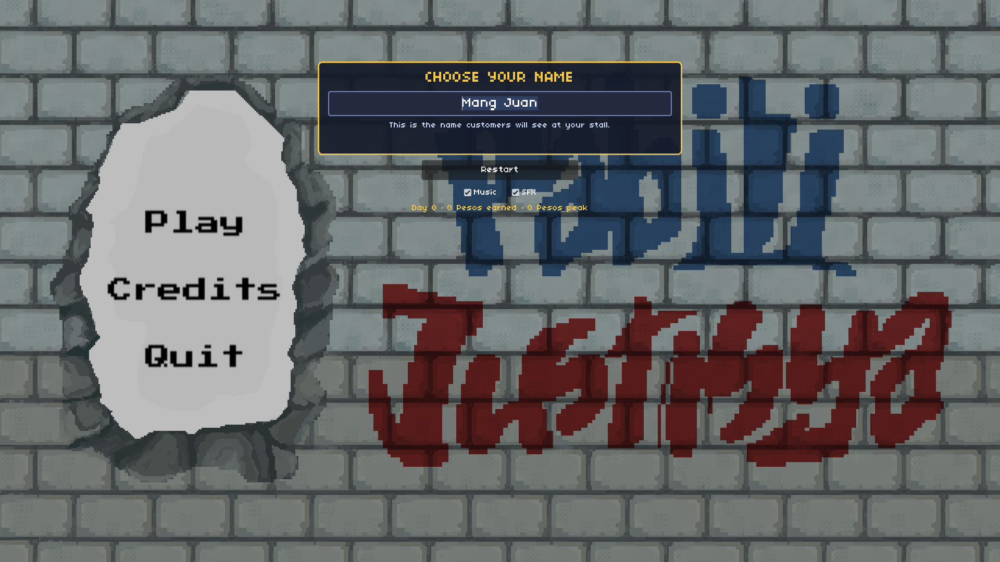
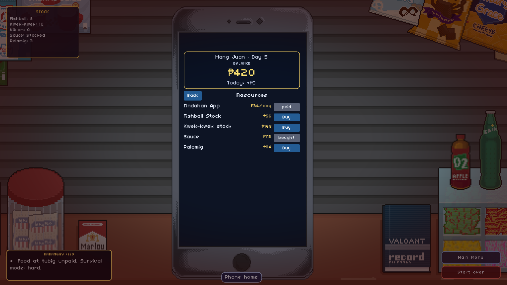
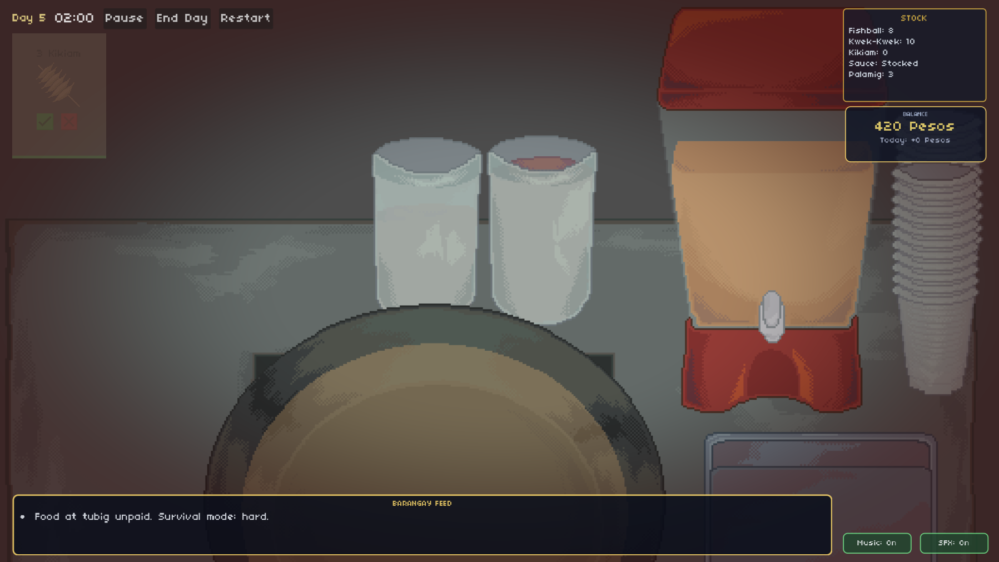
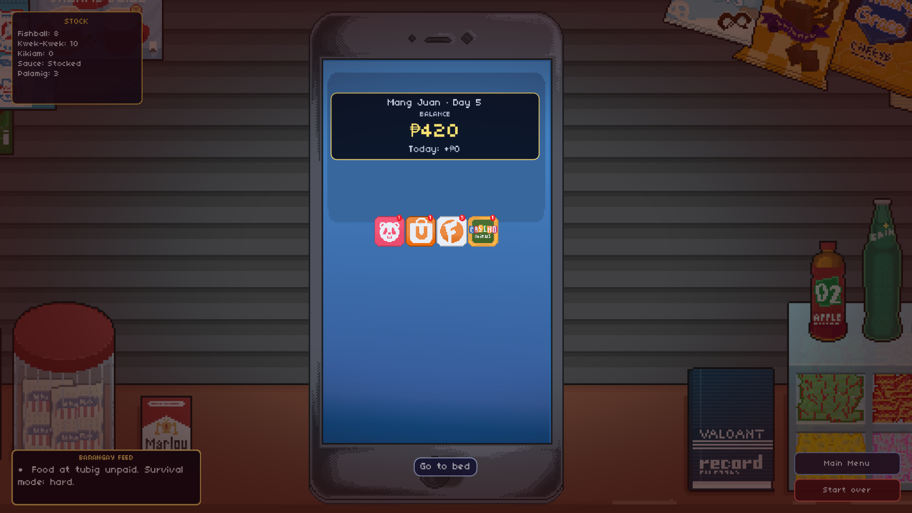
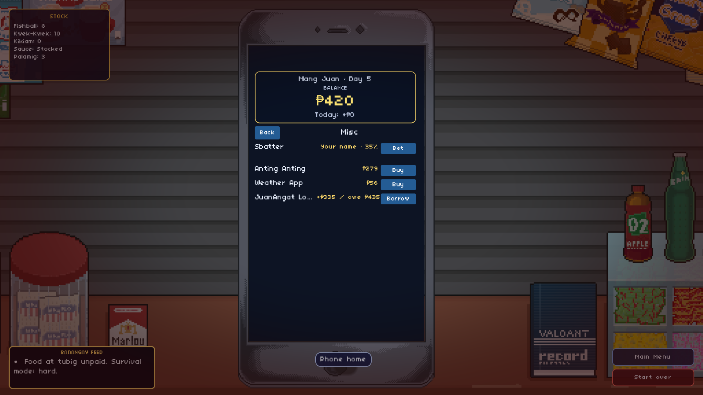
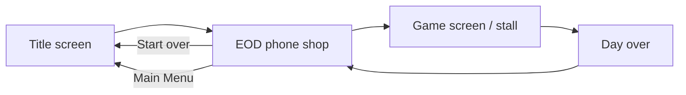
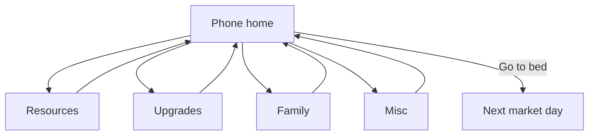
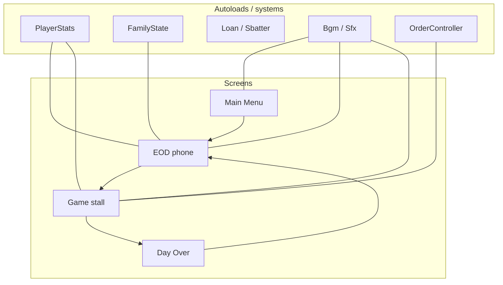

# COOKS TO GO

A Godot 4.7 street-food cart sim built for a game jam. You run a fishball stall, buy stock and pay bills on your phone each night, then serve timed customer orders during the day. Money is in **₱ (Pesos)**.

<p align="center">
  
</p>

| Night shop (Resources) | Stall HUD |
|:---:|:---:|
|  |  |

| Phone home (unread badges) | Misc tab |
|:---:|:---:|
|  |  |

## Requirements

- [Godot 4.7](https://godotengine.org/) (project targets 4.7, Forward+)
- 1920×1080 design resolution (window is resizable; stretch keeps aspect). **F11** / **Alt+Enter** toggles fullscreen.

## Run the game

Open the project in Godot and press **F5**, or from a terminal:

```bash
godot4 --path /path/to/COOKS-TO-GO
```

Headless smoke test (economy + day loop, no GPU):

```bash
godot4 --headless --audio-driver Dummy --path . --script res://tests/e2e_flow.gd
```

Expected last line: `=== ALL 5 STEPS PASSED ===`

## Game loop




### 1. Title screen

- Enter your vendor name (optional; defaults to your OS username).
- **Play** opens the end-of-day shop.
- **Restart** resets all progress and returns to the title screen.
- **Credits** lists attributions.
- **Quit** exits.

### 2. End of day (EOD) — `Screens/EOD/Scenes/Room.tscn`

Manage everything from the phone UI before the next market day. Unread apps show a red badge until you open them that night.



| Tab | What you do |
|-----|-------------|
| **Resources** | Buy fishball, kwek-kwek, kikiam, sauce, palamig stock; Tindahan App subscription |
| **Upgrades** | Unlock palamig cart, bigger container, faster cooking, slower burning |
| **Family** | Pay electricity, water, rent, food; buy medicine if someone is sick |
| **Misc** | Anting-anting, weather app, JuanAngat loan, Sbatter gamble |

**Go to bed** starts the next day when bills are handled and the family is healthy. **Main Menu** returns to the title without wiping the run; **Start over** resets.

**Starting money:** ₱1000.

**Resource prices (10 units per buy unless noted):**

| Item | Price |
|------|------:|
| Fishball | ₱50 |
| Kikiam | ₱75 (unlocks day 3+) |
| Kwek-kwek | ₱150 |
| Sauce | ₱100 (one-time) |
| Palamig stock | ₱75 (needs palamig upgrade) |

**Family bills (per night):**

| Bill | Price |
|------|------:|
| Electricity | ₱150 |
| Water | ₱50 |
| Rent | ₱75 |
| Food | ₱150 |
| Medicine | ₱300 (only when family is sick) |

**Upgrades:** Palamig ₱100 · Container ₱250 · Faster cooking ₱500 · Slower burning ₱200

**Misc:** Anting-anting ₱250 · Weather app ₱50 · JuanAngat loan +₱300 (owe ₱400) · Sbatter bet (one-time; wager your name for a chance at ₱250)

Unpaid rent three nights in a row → homelessness (higher sickness risk). Skipping food, water, or electricity also raises sickness risk.

### 3. Game screen — `Screens/Game/Scenes/GameScreen.tscn`

- **Timer** — 2-minute market day; ends automatically.
- **Pause / Play** — freezes the timer and order countdowns.
- **End Day** — end early and open the day-over screen.
- **Order cards** — up to five at once; green/yellow/red bar is time left.
  - **Confirm** — sells if you have stock (₱5 per item for fishball/kwek-kwek/kikiam).
  - **Cancel** — dismiss the order.
  - **Palamig-only orders** — opens the pour minigame (₱30 per cup served).
- **Money popups** — `+/- ₱` floats below the card; no running total during play.

BGM mood is sampled from your balance when a track starts (poor nights sound less jolly).

### 4. Palamig minigame

- Hold pour (mouse / Space) to fill the cup to the target line.
- Serve good pours; bad pours or spills cost ₱6 per wasted cup.
- **Esc** or **Back** exits without completing the order (countdown resumes).
- Stock syncs cup-by-cup from your palamig jug.

### 5. Day over

Shows balance and leftover stock. **Continue** advances the calendar, collects loan payments, rolls family/post-day events, and resets bill flags. Leftover stock carries to the next day.

## Controls (in-game)

| Context | Input |
|---------|--------|
| UI buttons | Mouse |
| Palamig pour | Hold left mouse or Space on jug |
| Palamig / Credits back | Esc |
| Fullscreen | F11 or Alt+Enter |

## Project layout



```
Audio/           BgmController, SfxController, music & SFX
Orders/          Order cards, spawning, confirm/cancel
Palamig/         Pour minigame
Player/          Stats, family state, loan, Sbatter
Screens/
  Main Menu/     Title, credits
  EOD/           Night shop (phone UI)
  Game/          Daytime stall
  Day Over/      End-of-day summary
tests/e2e_flow.gd Headless smoke test
docs/pr-screenshots/  README captures
```

## Audio credits

- Music: Kenney (CC0) — `Audio/Music/`
- UI SFX: Kenney Interface Sounds (CC0) — `Audio/SFX/`
- Palamig SFX: local wav assets under `Palamig/Assets/SFX/`

## Known gaps (jam scope)

- Pre/post-day random events (`willRain`, `nanakawan`, etc.) roll but do not change gameplay yet.
- Frying, trash, and storage actions have SFX hooks but no stall gameplay.
- Customer voice lines are not implemented.

## License

Game jam project. Check asset folders for third-party art/audio terms.
