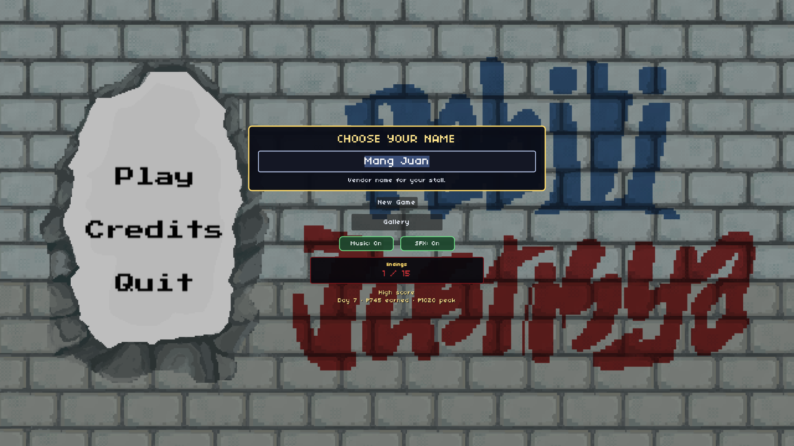
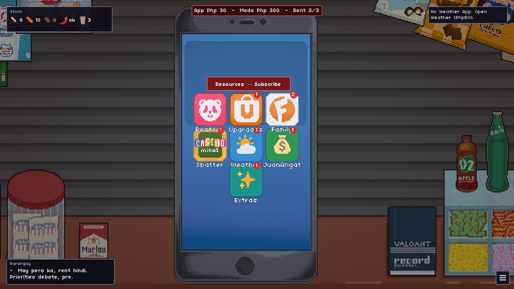
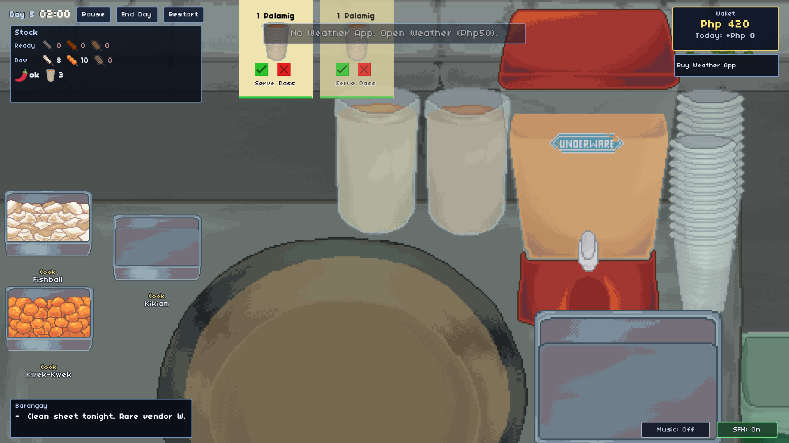
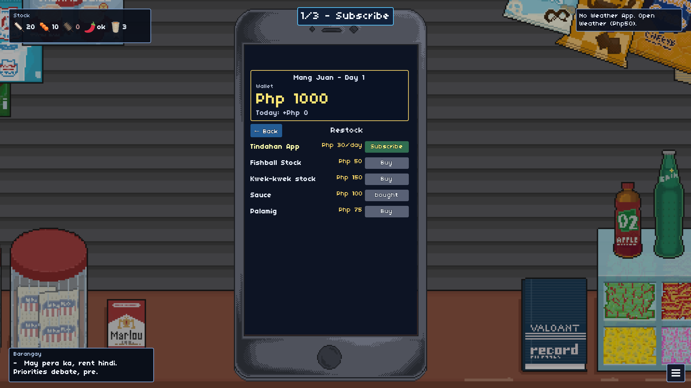
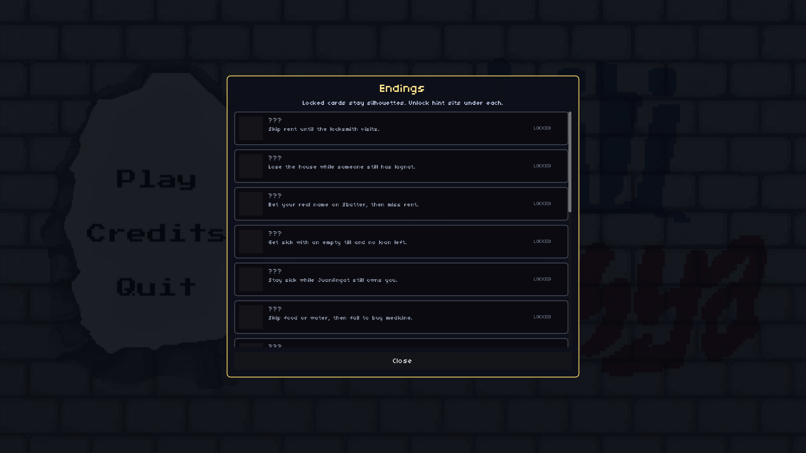
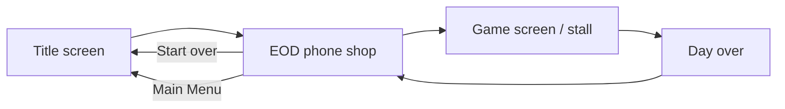
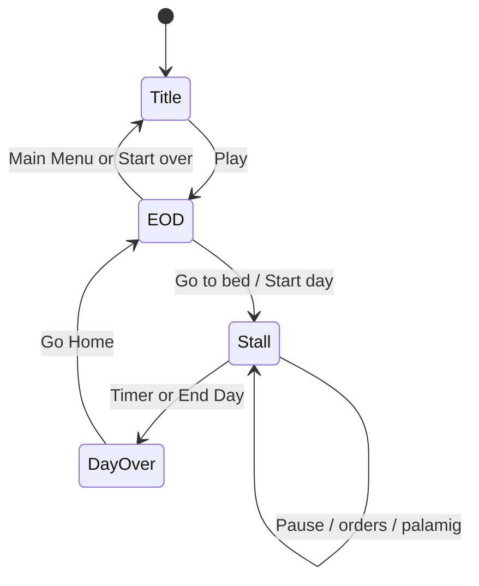
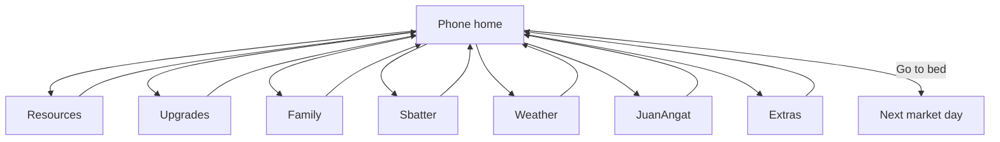
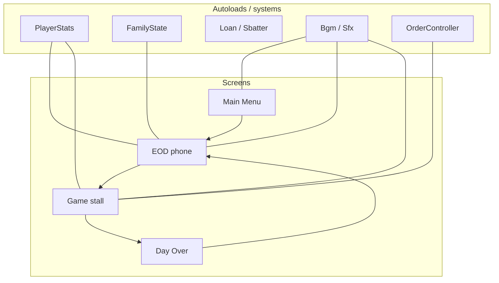

# COOKS TO GO

Pay the phone bill that keeps your stall “visible,” or lose the tarp : and maybe the roof : before the first fishball hits the oil.

A Godot 4.7 street-food cart sim built for a game jam. You run a fishball stall, buy stock and pay bills on your phone each night, then serve timed customer orders during the day. Money is in **Php (Pesos)**. Store copy lives in [`ITCH.md`](ITCH.md).

<p align="center">
  
</p>

| Night shop | Stall day |
|:---:|:---:|
|  |  |

| First-night coach | Endings gallery |
|:---:|:---:|
|  |  |

## Requirements

- [Godot 4.7](https://godotengine.org/) (project targets 4.7, Forward+)
- 1920×1080 design resolution (window is resizable; stretch keeps aspect). **F11** / **Alt+Enter** toggles fullscreen.

## Run the game

Open the project in Godot and press **F5**, or from a terminal:

```bash
godot4 --path /path/to/COOKS-TO-GO
```

Headless smoke test (economy + day loop, no GPU):

```bash
godot4 --headless --audio-driver Dummy --path . --script res://tests/e2e_flow.gd
```

Expected last line: `=== ALL 6 STEPS PASSED ===`

## Game loop





### 1. Title screen

- Enter your vendor name (optional; defaults to your OS username).
- **Play** opens the end-of-day shop (first night coaches: pay app → buy stock → start day).
- **Endings** / gallery card opens locked silhouettes with unlock hints (15 total).
- **Restart** resets all progress and returns to the title screen.
- **Credits** lists attributions.
- **Quit** exits.

### 2. End of day (EOD) : `Screens/EOD/Scenes/Room.tscn`

Manage everything from the phone UI before the next market day. Unread apps show a red badge until you open them that night.



| Tab | What you do |
|-----|-------------|
| **Resources** | Buy fishball, kwek-kwek, kikiam, sauce, palamig stock; Tindahan App subscription |
| **Upgrades** | Unlock palamig cart, bigger container, faster cooking, slower burning |
| **Family** | Pay electricity, water, rent, food; buy medicine if someone is sick |
| **Sbatter** | Bet (can wager your name) |
| **Weather** | Buy the Weather App forecast |
| **JuanAngat** | Borrow Paldo Loan+ |
| **Extras** | Anting-anting |

**Go to bed** starts the next day when bills are handled and the family is healthy. **Main Menu** returns to the title without wiping the run; **Start over** resets.

**Starting money:** Php 1000.

**Resource prices (10 units per buy unless noted):**

| Item | Price |
|------|------:|
| Fishball | Php 50 |
| Kikiam | Php 75 (unlocks day 3+) |
| Kwek-kwek | Php 150 |
| Sauce | Php 100 (one-time) |
| Palamig stock | Php 75 (needs palamig upgrade) |

**Family bills (per night):**

| Bill | Price |
|------|------:|
| Electricity | Php 150 |
| Water | Php 50 |
| Rent | Php 75 |
| Food | Php 150 |
| Medicine | Php 300 (only when family is sick) |

**Upgrades:** Palamig Php 100 - Container Php 250 - Faster cooking Php 500 - Slower burning Php 200

**Extras:** Anting-anting Php 250 - **Weather** app Php 50 - **JuanAngat** loan +Php 300 (owe Php 400) - **Sbatter** bet (one-time; wager your name for a chance at Php 250)

Unpaid rent three nights in a row → homelessness (higher sickness risk). Skipping food, water, or electricity also raises sickness risk.

### 3. Game screen : `Screens/Game/Scenes/GameScreen.tscn`

- **Timer** : 2-minute market day; ends automatically.
- **Pause / Play** : freezes the timer and order countdowns.
- **End Day** : end early and open the day-over screen.
- **Order cards** : up to five at once; green/yellow/red bar is time left.
  - **Serve** : sells if you have cooked tray stock (Php 5 per item for fishball/kwek-kwek/kikiam).
  - **Pass** : dismiss the order.
  - **Palamig-only orders** : opens the pour minigame (Php 30 per cup served).
- **Pan** : drop skewers from the side buttons; cook / burn bars; oil-bubble VFX while frying; click cooked into the ready tray, burnt into the trash.
- **Money popups** : `+/- Php` floats below the card; no running total during play.
- **Barangay Feed** : Taglish chismis strip that reacts to your run.

BGM mood is sampled from your balance when a track starts (poor nights sound less jolly).

### 4. Palamig minigame

- Hold pour (mouse / Space) to fill the cup to the target line.
- Serve good pours; bad pours or spills cost Php 6 per wasted cup.
- **Esc** or **Back** exits without completing the order (countdown resumes).
- Stock syncs cup-by-cup from your palamig jug.

### 5. Day over

Graphic wallet + stock chips. **Go Home** advances the calendar, collects loan payments, rolls family/post-day events, and resets bill flags. Leftover stock carries to the next day.

## Controls (in-game)

| Context | Input |
|---------|--------|
| UI buttons | Mouse |
| Palamig pour | Hold left mouse or Space on jug |
| Palamig / Credits back | Esc |
| Fullscreen | F11 or Alt+Enter |

## Project layout



```
Audio/           BgmController, SfxController, music & SFX
Cart/            Cooking, oil bubbles, food buttons
Orders/          Order cards, spawning, Serve/Pass
Palamig/         Pour minigame
Player/          Stats, family state, loan, Sbatter, endings, lore
Screens/
  Main Menu/     Title, credits, endings gallery
  EOD/           Night shop (phone UI)
  Game/          Daytime stall
  Day Over/      End-of-day summary
tests/e2e_flow.gd Headless smoke test
docs/pr-screenshots/  README captures
CREDITS.md       Team + third-party attributions
```

## Credits

Full attributions: [`CREDITS.md`](CREDITS.md). Sidecar notes sit next to the assets.

**Team:** Jiro, Yel, Goonard (game) - Isha, Bam (sprites) - Jo, Carlos, Nat (story)

**Third-party (short):**

| What | Who | License |
|------|-----|---------|
| Music | Kenney | CC0 |
| UI / stall SFX | Kenney Interface Sounds + RPG Audio | CC0 |
| Cook / fry SFX | Mixkit | Mixkit free SFX (attribution optional) |
| Oil bubble particles | Kenney Particle Pack | CC0 |
| Cursors | Kenney Cursor Pack | CC0 |
| Menu burger icon | Original (project) | CC0 |
| Day Over paper | ambientCG Paper001 | CC0 |
| Dialogue | Dialogic | MIT |

In-game **Credits** on the title screen lists the same team + a short asset blurb.

## Known gaps (jam scope)

- Customer voice lines are not implemented.

## Endings

- **10 bad endings** : cause-picked game overs (rent, sickness, app fee, Sbatter, loans).
- **5 good endings** : survive a week, clear debt with cash left, finish the cart upgrades, keep a roof for 10 days, or pay food/water/power for 7 nights straight.

## Overnight & weather

Post-day rolls (theft, leftover cash, sickness) change money/stock and show on the EOD **morning briefing**.
Pre-day weather (ulan / hot rush / ordinary) changes order spawn rate, patience, and palamig demand, with a stall banner when the day opens. Weather app subscription improves the chance of an ordinary day and labels the forecast.

## License

Game jam project. Third-party terms are in [`CREDITS.md`](CREDITS.md) and the `*_CREDITS.txt` files next to each asset pack. Engine and Dialogic are MIT.
